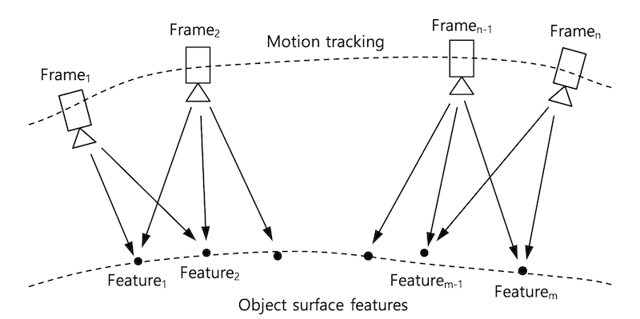
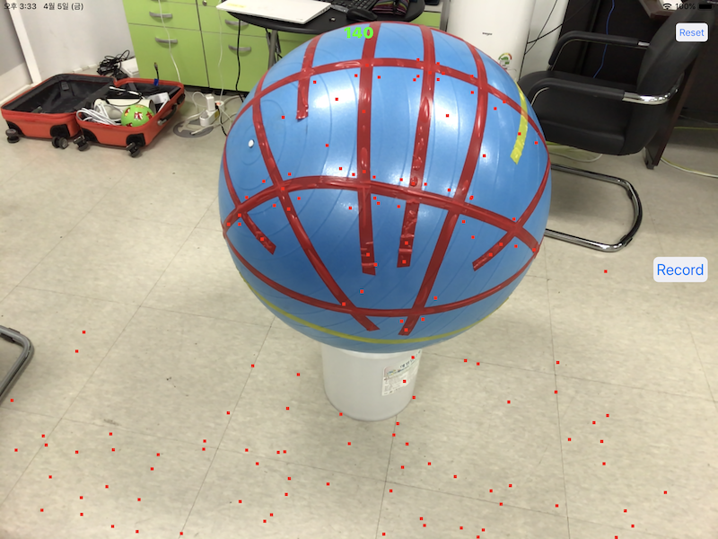
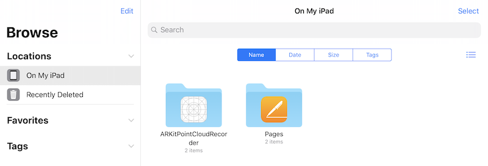
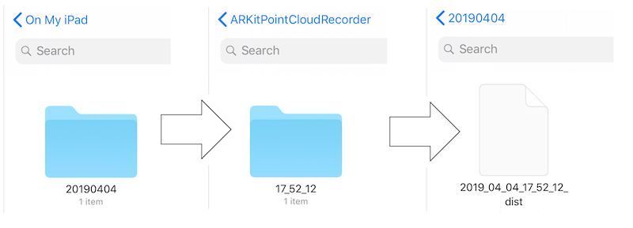

# ARKit Point Cloud Recorder


## Abstract

ARKitPointCloudRecorder is a demo application developed by CurvSurf for recording and filtering the point cloud generated by Apple ARKit.

> PLEASE CITE EXPLICITLY 'POWERED BY CURVSURF', WHEN YOU ARE PUBLISHING OR REPORTING THE RESULTS OF 'ARKITPOINTCLOUDRECODER'.


## Background of Apple ARKit



A running [`ARSession`][L_ARSESSION] continuously captures video frames from the device camera. For each frame, [`ARKit`][L_ARKIT] analyzes the image together with data from the device's motion sensing hardware to estimate the device's real-world position and orientation. [`ARKit`][L_ARKIT] delivers this tracking information and imaging parameters in the form of an [`ARFrame`][L_ARFRAME] object.

The point cloud (collection of points/features) main intention is a debug visualization to what the underlying tracking algorithm processes and is not designed for additional algorithms on top of that. But, CurvSurf is utilizing information contained in the points/features collected by [`ARKit`][L_ARKIT].

Every updated [`ARFrame`][L_ARFRAME] has list of the feature points ( see [here](https://developer.apple.com/documentation/arkit/arframe/2887449-rawfeaturepoints) ). Every features has their own unique IDs through multiple frames. But due to measurement error, the world coordinates of each features among different frames may vary. 


## In our program

The purpose of this program is to collect feature points and store them to local storage.
There are 3-ways to store feature points data.

1. Store every feature points on each and every frames.
1. Store mean points of each features (that has same unique ID) of multiple frames.
1. Store mean points of each features (that has same unique ID) of multiple frames with filtering by using standard deviation.


## How to use Program



| UI                                                | TYPE   | DESC                                                                     |
|---------------------------------------------------|--------|--------------------------------------------------------------------------|
| <span style="color:#00FF00">**140**</span>        | LABEL  | # of the red points (the extracted feature points of latest frame). |
| <span style="color:#007AFF">Reset</span>          | BUTTON | reset the motion tracking.                                               |
| <span style="color:#007AFF">Record / Stop</span>  | BUTTON | start / stop recording the points.                                       |

1. Press **Record** button if you want to start recording (collection) feature points.

1. After recording is finish (when press the **Stop** button), under the application directory *ARKitPointCloudRecorder*, the directories and file of point cloud (.xyz) are automatically created:

> On My iPad &gt; ARKitPointCloudRecorder &gt; yyyymmdd &gt; hh_mm_ss &gt; yyyy_mm_dd_hh_mm_ss_dist.xyz




   

## Primary Methods to Know

1. Triggering Start & Stop Recording

    ```swift
    // ViewController.swift

    @IBAction func onClickRecord(_ sender: Any) {
        isRecording = !isRecording
        
        if isRecording { // start recording
            recorder.reset() // clear prev. data
            recordBtn.setTitle("Stop", for: .normal)
        }
        else { // stop recording
            recordBtn.isEnabled = false
            recordBtn.isHidden = true
            
            recorder_queue.async 
            {
                //
                // TODO: Save Feature Points to File ( see "Save Feature Points" below )
                //

                // Update UI after Saving Files
                DispatchQueue.main.async{
                    self.recordBtn.isHidden = false
                    self.recordBtn.isEnabled = true
                    self.recordBtn.setTitle("Record", for: .normal)
                }
            }
        }
    }
    ```
1. Collecting Feature Points

    ```swift
    // ViewController.swift

    // MARK: - ARSessionDelegate
    
    // Called whenever the ARFrame has been updated
    func session(_ session: ARSession, didUpdate frame: ARFrame) {
        if isRecording { 
            if let features = frame.rawFeaturePoints {
                switch frame.camera.trackingState {
                case .normal: // appened points only if tracking state is normal
                    recorder.appendPoints(from: features)
                default:
                    break
                }
            }
        }
    }
    ```

1. Save Feature Points

    ```swift
    // ViewController.swift

    // let documentURL = FileManager.default.urls(for: .documentDirectory, in: .userDomainMask)[0]

    // Case 1: Save Full Feature Points
    let fullFileURL = documentURL.appendingPathComponent( "full.xyz" )
    self.recorder.saveFullPoints(to: fullFileURL.path)

    // Case 2: Save Mean Points of each Identifiers
    let avgFileURL = documentURL.appendingPathComponent( "avg.xyz" )
    self.recorder.saveAveragePoints(to: avgFileURL.path)

    // Case 3: Save Mean Points of each Identifiers with Distance Standard Deviation Filter (default zscore value is 1.5)
    let distFileURL = dstURL.appendingPathComponent( "\(nowStr)_dist.xyz" )
    self.recorder.saveDistanceFilterAveragePoints(to: distFileURL.path)
    
    // Case 3: with your own zscore
    let zscore: Float = 2.0
    let distFileURL = dstURL.appendingPathComponent( "\(nowStr)_dist_\(zscore).xyz" )
    self.recorder.saveDistanceFilterAveragePoints(to: distFileURL.path, zscore: zscore)
    ```

    see `PointManager.hpp` and `PointManager.cpp` if you want more detail about how to manage collecting feature points and get mean points of the feature points.

## Contact

Send an email to support@curvsurf.com to contact our support team, if you have any question to ask.

## License

This project is licensed under the MIT License. Copyright 2019 CurvSurf.


[L_ARKIT]: https://developer.apple.com/documentation/arkit
[L_ARSESSION]: https://developer.apple.com/documentation/arkit/arsession
[L_ARFRAME]: https://developer.apple.com/documentation/arkit/arframe
